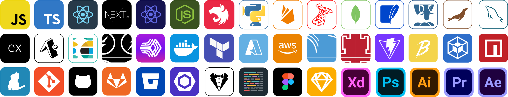

 

    
    
    
     
     

 
<h1 align="center">
    
</h1>

Sou Engenheiro de Software focado em Javascript sendo um eterno estudante, procurando constante aperfeiçoamento, trabalhando para obter reconhecimento e atingir os melhores resultados e objetivos indo em busca do crescimento pessoal e profissional mas mantendo o foco. Enxergo os desafios como oportunidades de criar novas soluções e otimizar processos.

Dentre os projetos que participei na minha carreira:

- Desenvolvimento de uma lista de contatos para conectar os colaboradores da [TORA Transportes LTDA](https://tora.com.br/) de forma simples porém efetiva, implementando a parte de back-end e front-end além da implementação de segurança para evitar alteração de informações de usuários sem privilégios de admin vinculado ao Microsoft® Azure.

- Desenvolvimento do chatbot vinculado ao app da [TORA Transportes LTDA](https://tora.com.br/) utilizando os conceitos básicos de UX writing além de implementações da comunicação externa utilizada pelo mesmo.

- Participação na concepção de telas do app da [TORA Transportes LTDA](https://tora.com.br/) e do portal utilizado internamente pelos colaboradoores com mais de 4 mil usuários ativos.

- Trabalho alocado no cliente pela [Stefanini](https://stefanini.com/pt-br) desenvolvendo novas features fazendo manutenção do app pretencente a [Cencosud](https://www.cencosud.com/pt) onde atuei diretemente em campanhas comemorativas para as bandeiras [Bretas](https://www.bretas.com.br/), [Prezunic](https://www.prezunic.com.br/), [GBarbosa](https://www.gbarbosa.com.br/), [Mercantil](https://www.mercantilrodrigues.com.br/) e [Perini](https://www.perini.com.br/).

---

I'm a Sofware Engineer focused on Javascript, being an eternal student looking for constant improvement, working to get recognition and achieve the best results and goals going in search of personal and professional growth but keeping the focus. I see challenges as opportunities to create new solutions and optimize processes.

Among the projects I participated in my career:

- Development of a contact list to connect the employees of [TORA Transportes LTDA](https://tora.com.br/) in a simple but effective way, implementing the back-end and front-end part in addition to the implementation of security to avoid changing user information without admin privileges linked to Microsoft® Azure.

- Development of the chatbot linked to the [TORA Transportes LTDA](https://tora.com.br/) app using the basic concepts of UX writing as well as implementations of the external communication used by it.

- Participation in the design of the app screens of [TORA Transportes LTDA](https://tora.com.br/) and the portal used internally by employees with more than 4 thousand active users.

- Work allocated to the client by [Stefanini](https://stefanini.com/pt-br) developing new features maintaining the app belonging to [Cencosud](https://www.cencosud.com/pt) where I worked directly in commemorative campaigns for the [Bretas](https://www.bretas.com.br/), [Prezunic](https://www.prezunic.com.br/), [GBarbosa](https://www.gbarbosa.com.br/), [Mercantil](https://www.mercantilrodrigues.com.br/) and [Perini](https://www.perini.com.br/) banners.

 

 
